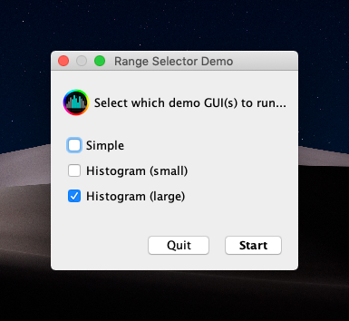

# Range Selector
This is a utility for generating a GUI and related controllers/providers to obtain a selectable range. The initial target
is for selecting a frequency range in a simple and intuitive way. Currently, this is specifically for selecting a 2D
range along the X-axis.

Initially, this will focus on providing a Swing based GUI for selecting a range of values, but the goal is to 
offer both Swing and JavaFX-based solutions eventually.

## Examples
One common feature is the ability to lock the range selection; this will preserve the current state until unlocked whether
that state includes a selected range or not.

This is the ultra-simple proof-of-concept view:


Here is a basic histogram-based range selection view with an icon (that doubles as a button) showing the lock state:


### Demo App
The demo application is what runs when you execute the Spring application (`./gradlew bootRun`)



## Requirements
This project requires:
* JDK 11 ([AdoptOpenJDK](https://adoptopenjdk.net) is an excellent, free, OpenJDK option.)
* [JFormDesigner](https://www.formdev.com) for working with the Swing UI `.jfd` files

### Other Key Libraries
This project leverages a few key libraries:
* Spring Boot (dependency injection framework and application runner)
* Apache Commons Lang3 (primarily for the `Range` class)

## Building

To build this project:
```shell script
./gradlew clean build
```

## Usage

### Command Line Runner Example

To run the basic sample from the command line, execute:
```shell script
./gradlew runSample
```

### As a Library in Your Project

This is intended to be pulled into another project as a library.

Add the dependency:
```groovy
implementation 'com.mikeoertli:range-selector'
```

Inject the `RangeSelectorProvider` and request a `RangeSelectorController`:
```java
public class MyApplication {
    
    private final RangeSelectorProvider rangeSelectorProvider;

    @Inject
    public MyApplication(RangeSelectorProvider rangeSelectorProvider)
    {
        this.rangeSelectorProvider = rangeSelectorProvider;
    }
    
    public void doStuff()
    {
        RangeSelectorController controller = rangeSelectorProvider.createRangeSelectorController();
        
        RangeSelectorPanel panel = controller.getPanel();

        // ...
    }

}
```


## Author

[Mike Oertli](https://github.com/mikeoertli)


Questions, comments, and pull requests are welcome!